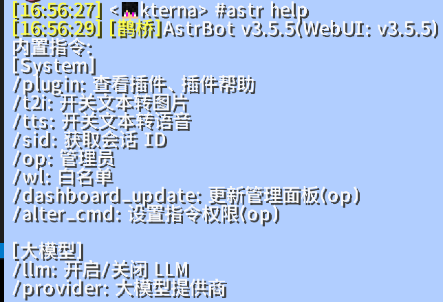

# MCQQ 插件

一个通过鹊桥模组实现Minecraft平台适配器，以及mcqq互联的插件。
[](https://github.com/kterna/astrbot_plugin_mcqq)
[](https://deepwiki.com/kterna/astrbot_plugin_mcqq)
## 功能

- 将 Minecraft 聊天消息转发到 QQ 群
- 将 QQ 群消息转发到 Minecraft 服务器
- 支持玩家加入/退出服务器的消息通知
- 在游戏内输入"#qq"开头的消息可自动转发到QQ群
- 在游戏内输入"#"开头的消息可调用astrbot框架的指令或llm
- 支持多个Minecraft服务器之间的消息互通
- 支持服务器之间的玩家状态同步

## 推荐插件

[astrbot_plugin_litematic](https://github.com/kterna/astrbot_plugin_litematic): 一个用于管理和分享Litematic投影文件的插件。支持投影文件的上传、下载、预览和分类管理

## 注意事项

- 目前为测试性开发，未测试所有minecraft客户端，可能存在未知问题
- 在minecraft中使用astrbot命令无法支持图片、语音、视频等，目前仅支持文字
- 可以配置筛选假人消息不广播，假人通过前缀或后缀进行筛选
- RCON配置修改之后需要完全重启astrbot才能重载
- 更新版本后若平台适配器中未出现对应配置项请删除重新创建
- 多服务器互通功能需要所有服务器都安装鹊桥模组

## 安装要求

- Minecraft 服务器安装[鹊桥模组queqiao](https://www.curseforge.com/minecraft/mc-mods/queqiao)

### 使用说明

在平台适配器中新增minecraft平台适配器，并配置相关配置连接到minecraft服务器
在服务器中可使用"#astr"命令进行astrbot自身的指令或llm



### 配置项说明

- `WEBSOCKET_URL`: 鹊桥模组的WebSocket服务器地址
- `SERVER_NAME`: 服务器名称，必须与鹊桥模组配置中的server_name一致
- `AUTHORIZATION`: 访问令牌，如果鹊桥模组配置了access_token则需要填写
- `QQ_MESSAGE_PREFIX`: 转发到QQ消息的前缀
- `ENABLE_JOIN_QUIT_MESSAGES`: 是否转发玩家加入/退出服务器的消息
- `MAX_RECONNECT_RETRIES`: 连接断开后最大重试次数，默认5次
- `RECONNECT_INTERVAL`: 重连间隔（秒），默认3秒
- `FILTER_BOTS`:是否开启假人消息筛选
- `BOT_PREFIX`:假人前缀
- `BOT_SUFFIX`:假人后缀
- `RCON_ENABLED`:是否启用RCON命令
- `RCON_HOST`:RCON地址
- `RCON_PORT`:RCON端口
- `RCON_PASSWORD`:RCON密码(必填)

## 更新日志

- v1.6.1 增加多服务器分别设置广播内容功能，修改广播数据结构
- v1.6.0 增加多服务器互通功能，支持服务器间消息转发
- v1.5.1 修复bug，注册命令更简单、可维护
- v1.5.0 增加wiki查询，增加整点广播支持富文本内容
- v1.4.0 增加rcon命令
- v1.3.2 修复bug
- v1.3.1 修复bug，增加识别假人功能，若配置中未出现对应配置项请删除重新创建
- v1.3.0 增加了minecraft平台适配器，将minecraft服务器接入了astrbot框架
- v1.2.0 fix README
- v1.1.0 修复插件数据路径，增加多服务端的支持
- v1.0.0 发布测试版本

## TODO
支持更多minecraft服务器

## 命令

qq命令:

- `mc帮助`:获取指令帮助
- `mcsay <消息>`:向所有已连接的Minecraft服务器发送消息
- `mcbind`:绑定群聊
- `mcunbind`:取消绑定
- `mcstatus`:查看所有Minecraft适配器的连接状态和绑定信息
- `rcon <指令>`:向服务器控制台发送指令

mc命令:

- `#qq <消息>`:向qq群发送消息
- `#<消息>`:调用astrbot框架的指令或llm

## 鹊桥模组配置

确保Minecraft服务器已安装鹊桥模组（queqiao），并且config.yml配置如下：

```json
{
  "server_name": "Server",  // 必须与插件中的SERVER_NAME一致
  "access_token": "your_secure_token",  // 建议设置安全token并在插件配置中填写相同的值
  "websocket": {
    "host": "127.0.0.1",
    "port": 8080
  }
}
```

## 整点广播

### 功能说明
整点广播系统会在每个整点时间（如1:00、2:00、3:00...）自动向Minecraft服务器发送广播消息。消息支持富文本格式，包括：
- 🕐 金色粗体时钟图标
- 青色广播内容文本
- 悬浮显示"🤖 AstrBot 整点报时系统"
- 点击建议执行`/time query daytime`命令

### 管理命令

#### `/mc广播设置 [adapter.id] [配置]`
设置整点广播的富文本内容
- **权限**: 仅管理员
- **格式**: 支持简单文本或富文本组合模式
- **简单模式**: `mc广播设置 [adapter.id] 整点报时！当前时间：{time}`
- **富文本模式**: `mc广播设置 [adapter.id] 文本,颜色,粗体,点击命令,悬浮文本|文本2,颜色2,粗体2,点击命令2,悬浮文本2`
- **参数说明**: 
  - `{time}` - 当前时间变量
  - 颜色：gold、red、aqua、white等Minecraft颜色
  - 粗体：true/false
- **示例**: 
  - 简单: `/mc广播设置 [adapter.id] 🕐 整点报时！当前时间：{time}`
  - 富文本: `/mc广播设置 [adapter.id] 🕐,gold,true,,|整点报时！时间：{time},aqua,false,/time query daytime,点击查询游戏时间`

#### `/mc广播开关`
开启或关闭整点广播功能
- **权限**: 仅管理员
- **功能**: 切换广播系统的启用状态

#### `/mc广播测试`
立即测试发送一次整点广播
- **权限**: 仅管理员  
- **功能**: 使用当前设置发送测试广播

#### `/mc自定义广播 [文本]|[点击命令]|[悬浮文本]`
发送自定义的富文本广播消息
- **权限**: 仅管理员
- **格式**: 红色粗体"[管理员公告]"前缀
- **参数**: 
  - `文本`: 广播显示的主要内容
  - `点击命令`: 点击消息时建议执行的命令
  - `悬浮文本`: 鼠标悬浮时显示的提示文本
- **示例**: `/mc自定义广播 欢迎来到服务器！|/say test|点击发送测试`

## 多服务器互通

### 功能说明
插件支持多个Minecraft服务器之间的消息互通，包括：
- 玩家聊天消息自动转发
- 玩家加入/退出消息同步
- 玩家死亡消息同步
- 服务器状态监控

### 使用方法
1. 在平台适配器中添加多个Minecraft适配器
2. 为每个适配器配置不同的服务器信息
3. 使用`/mcstatus`命令查看所有适配器状态
4. 使用`/mcsay`命令向所有服务器发送消息

## 安装和配置

1. 将插件文件夹放置到AstrBot的插件目录
2. 在Minecraft服务器中安装[鹊桥模组](https://github.com/17TheWord/QueQiao)
3. 配置适配器连接信息
4. 使用`/mcbind`命令绑定QQ群与服务器

## 命令列表

### QQ群命令
- `/mcbind` - 绑定当前群聊与Minecraft服务器
- `/mcunbind` - 解除群聊绑定
- `/mcstatus` - 查看所有Minecraft适配器的连接状态和绑定信息
- `/mcsay [消息]` - 向所有已连接的Minecraft服务器发送消息
- `/rcon [指令]` - 执行RCON指令（仅管理员）
- `/mc广播设置 [配置]` - 设置整点广播内容（仅管理员）
- `/mc广播开关` - 开启/关闭整点广播（仅管理员）
- `/mc广播测试` - 测试整点广播（仅管理员）
- `/mc自定义广播 [文本]|[点击命令]|[悬浮文本]` - 发送自定义广播（仅管理员）
- `/mc帮助` - 显示帮助信息

### Minecraft命令
- `#[消息]` - 发起AI对话
- `#qq [消息]` - 向QQ群发送消息

## 技术说明

### 富文本消息格式
插件使用鹊桥模组的WebSocket API发送富文本消息，支持：
- **文本样式**: 颜色、粗体、斜体、下划线等
- **交互事件**: 
  - `click_event`: 点击执行命令或打开链接
  - `hover_event`: 悬浮显示额外信息
- **组合消息**: 多个文本组件组成的复杂消息

## 依赖要求

- AstrBot框架
- 鹊桥模组（Minecraft端）
- asyncio
- websockets
- json

## 许可证

本项目采用MIT许可证。